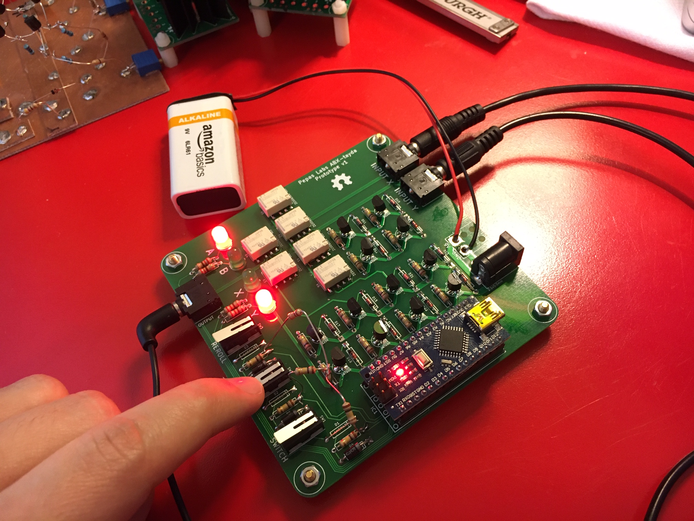
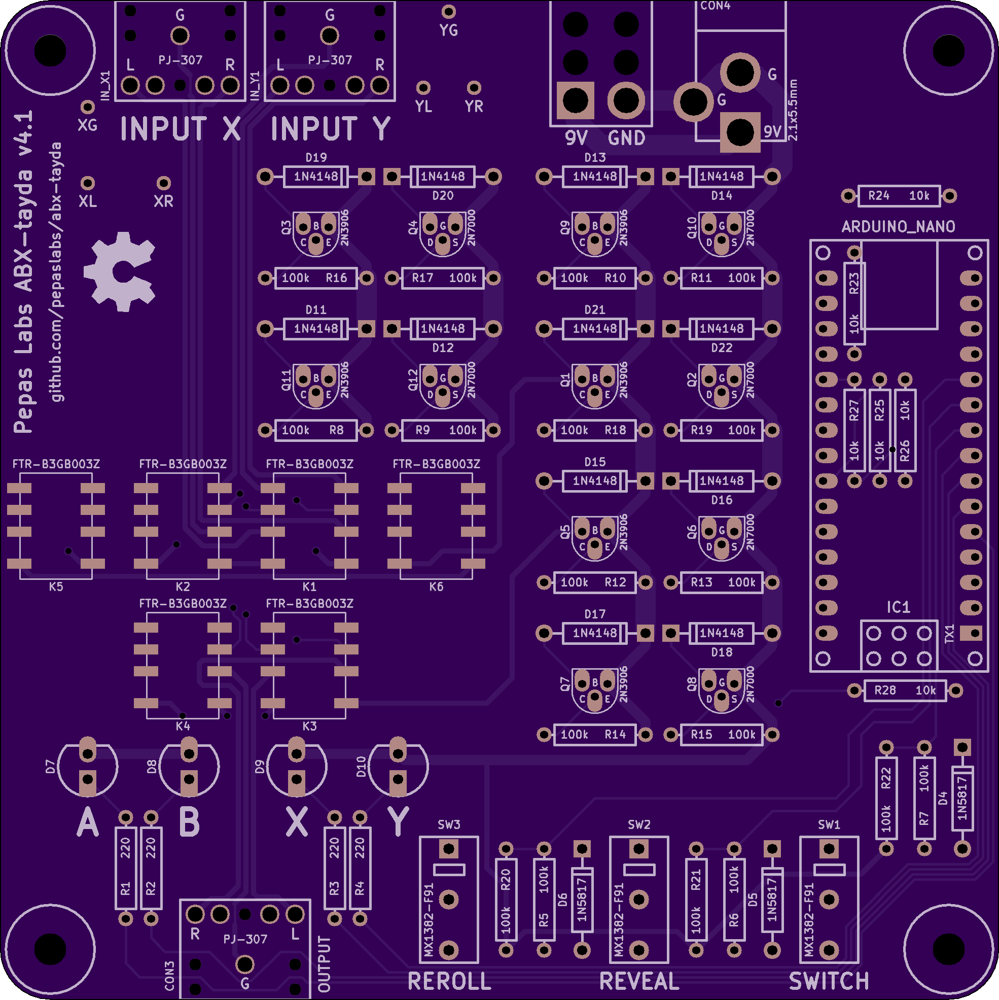
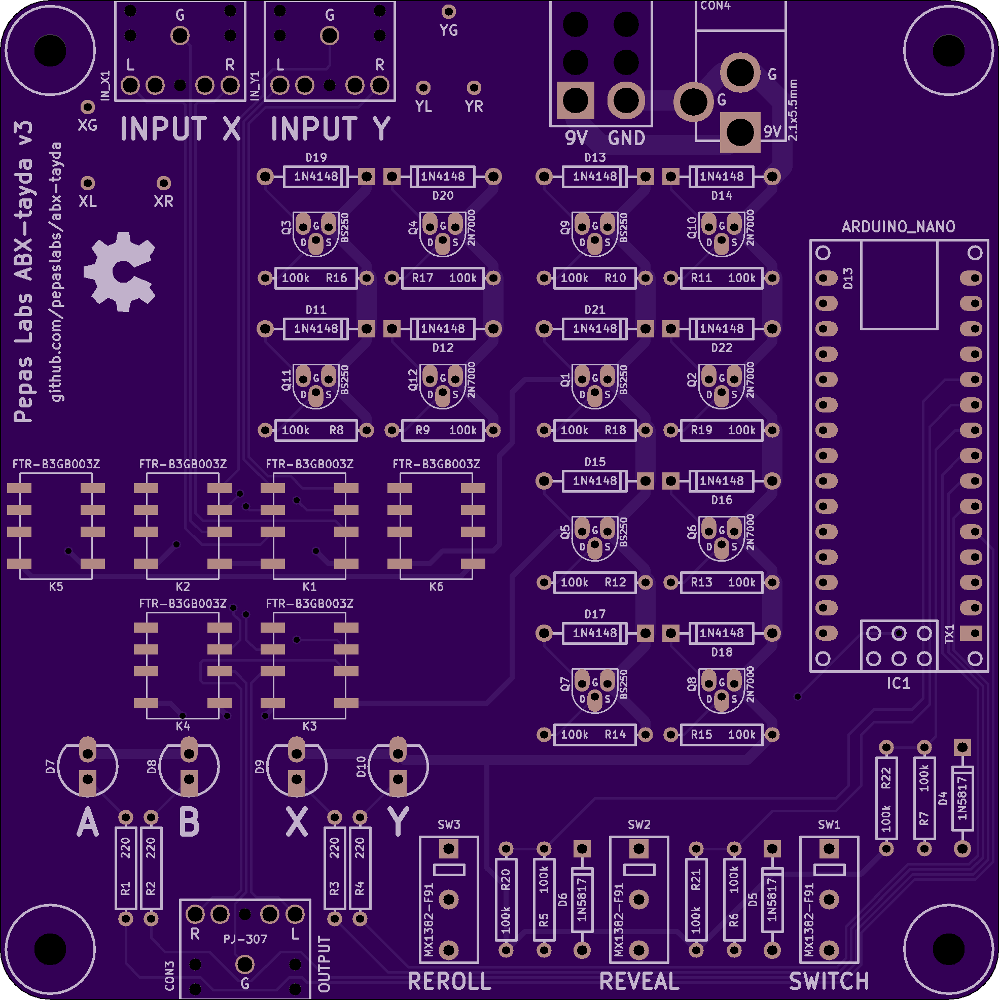

# abx-tayda

A relay board for performing blind A/B testing of two audio sources.

This version of the board is designed around parts available from [Tayda electronics](https://www.taydaelectronics.com/).

See the thread at [diyaudio.com](https://www.diyaudio.com/forums/equipment-and-tools/361743-abx-box.html).

This board design is open source hardware, released under the terms of the [MIT license](https://opensource.org/licenses/MIT).  It requires an [ancient version of Kicad](https://archive.org/details/2013-kicad) (sorry, not sorry 😝).  Debian users will need to add a jessie source to install the libpng12 dependency.

## v4.1 release

[schematic](releases/v4.1/abx.pdf)

[gerbers.zip](releases/v4.1/gerbers.zip)

[firmware](https://github.com/pepaslabs/abx-tayda/blob/main/releases/v4.1/firmware/abx/abx.ino)

Changes from v4:
- Include missing base resistor R28.

### Bill of materials

- **D4-6**: three 1N5817 Schottky diodes.
  - Any diode will work, but the lower voltage drop of Schottky diodes extracts more useful life from the 9V battery.
  - [Tayda](https://www.taydaelectronics.com/1n5817-diode-schottky-1a-20v.html)
- **D7-10**: four LED's.
  - Any color.  3mm or 5mm.
  - [Tayda](https://www.taydaelectronics.com/leds/round-leds/5mm-leds/led-5mm-red.html)
- **D11-22**: twelve 1N4148 diodes.
  - Flyback diodes.  Any diode will work here.
  - [Tayda](https://www.taydaelectronics.com/1n4148-switching-signal-diode.html)
- **R1-4**: four 220R 1/4 watt resistors.
  - LED current limiting.  Tune the resistance value to get the LED brightness you prefer.
  - [Tayda](https://www.taydaelectronics.com/resistors/1-4w-metal-film-resistors/resistor-220-ohm-1-4w-1-metal-film-pkg-of-10.html)
- **R5-7,20-22**: six 100k 1/4 watt resistors.
  - Voltage dividers for Arduino inputs.  5% carbon film or 1% metal film.
  - [Tayda](https://www.taydaelectronics.com/resistors/1-4w-metal-film-resistors/10-x-resistor-100k-ohm-1-4w-1-metal-film-pkg-of-10.html)
- **R8-19**: twelve 100k 1/4 watt resistors.
  - MOSFET gate pull-up and pull-down resistors.  5% carbon film or 1% metal film.
  - [Tayda](https://www.taydaelectronics.com/resistors/1-4w-metal-film-resistors/10-x-resistor-100k-ohm-1-4w-1-metal-film-pkg-of-10.html)
- **R23-27**: six 10k 1/4 watt resistors.
  - PNP base current-limiting resistors.  5% carbon film or 1% metal film.
  - [Tayda](https://www.taydaelectronics.com/resistors/1-4w-metal-film-resistors/10-x-resistor-10k-ohm-1-4w-1-metal-film-pkg-of-10.html)
- **SW1-3**: three miniature micro switches.
  - Tayda [MX1382-F91](https://www.taydaelectronics.com/mx1382-f91-micro-switch-1p2t-1a-mx1382-f91.html)
- **Q1,3,5,7,9,11**: six 2N3906 PNP BJT transistors.
  - [Tayda](https://www.taydaelectronics.com/2n3906-general-propose-pnp-transistor.html)
  - Any TO-92 PNP transistor which can handle 100mA (with an EBC pinout) will work fine.
- **Q2,4,6,8,10,12**: six 2N7000 N-channel MOSFETs.
  - [Tayda](https://www.taydaelectronics.com/2n7000-mosfet-n-channel-60v-0-2a.html)
  - Any TO-92 N-channel MOSFET which can handle 100mA (with an SGD pinout) will work fine.
- **K1-6**: six 3V latching relays
  - Tayda [FTR-B3GB003Z](https://www.taydaelectronics.com/ftr-b3gb003z-b10-mini-relay-dpdt-3vdc-1a.html)
- **CON1-3**: three 3.5mm headphone jacks
  - Tayda [PJ-307](https://www.taydaelectronics.com/3-5mm-stereo-enclosed-socket-chassis-jack.html)
  - Digikey [SJ1-3523N](https://www.digikey.com/en/products/detail/cui-devices/SJ1-3523N/738689)
- **IC1**: one Arduino Nano board.
  - Any $5 Arduino Nano board on ebay will work fine.

Choose one:
- **CON4**: 2.1x5.5mm DC barrel jack
  - [Tayda](https://www.taydaelectronics.com/dc-power-jack-2-1mm-barrel-type-pcb-mount.html)
  - [Tayda](https://www.taydaelectronics.com/9v-9-volt-battery-clip-connector-with-barrel-jack-plug.html)
  - [Tayda](https://www.taydaelectronics.com/9v-battery-holder-with-barrel-jack-plug.html)
- **P1**: 9V battery pigtail

## v4 release

[schematic](releases/v4/abx.pdf)

[gerbers.zip](releases/v4/gerbers.zip)

[firmware](https://github.com/pepaslabs/abx-tayda/blob/main/releases/v4/firmware/abx/abx.ino)

Changes from v3:
- Use 2N3906 PNP BJT's which are cheaper than BS250 P-channel MOSFETs (and are available from tayda)
- Use wider traces for the signal path.

## v3 release

[schematic](releases/v3/abx.pdf)

[gerbers.zip](releases/v3/gerbers.zip)

[firmware](https://github.com/pepaslabs/abx-tayda/blob/main/releases/v3/firmware/abx/abx.ino)

Changes from v2:
- Add test points to input X and Y for volume matching convenience.
- Use pins RX0, TX1 instead of A6, A7 (which cannot be used a digital outputs).

## v2 release

This release fixes a couple of bugs from v1:
- Replaced the 100k input resistors with proper voltage dividers.
- Fixed the silkscreen outline of the relays.
