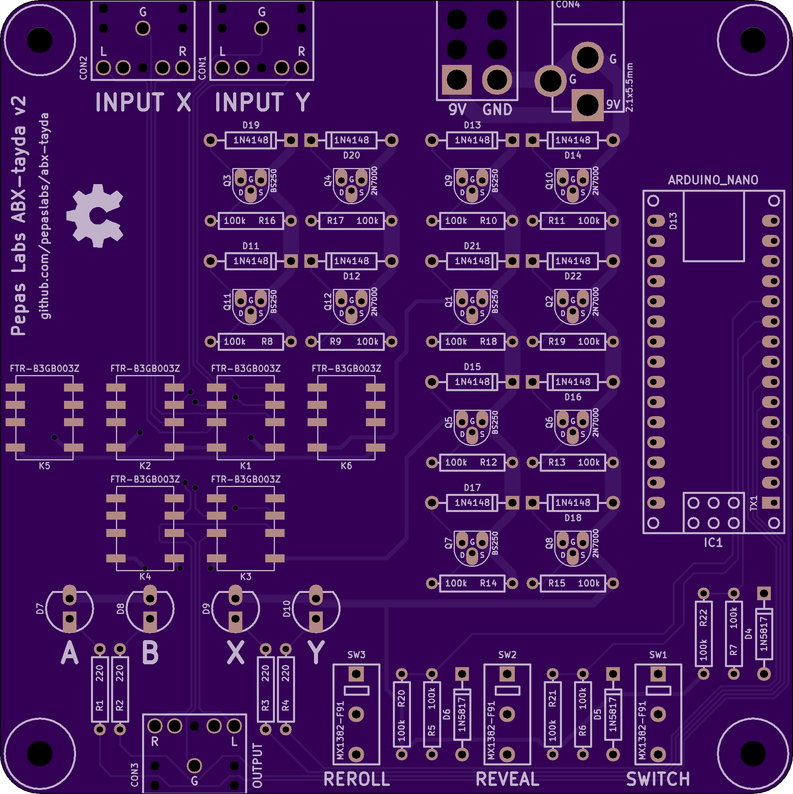

# abx-tayda

A relay board for performing blind A/B testing of two audio sources.

This version of the board is designed around parts available from [Tayda elecronics](https://www.taydaelectronics.com/).

See the thread at [diyaudio.com](https://www.diyaudio.com/forums/equipment-and-tools/361743-abx-box.html).

## v2 release

[gerbers.zip](releases/v2/gerbers.zip)

This release fixes a couple of bugs from v1:
- Replace the 100k input resistors with proper voltage dividers.
- Fix the silkscreen outline of the relays.

